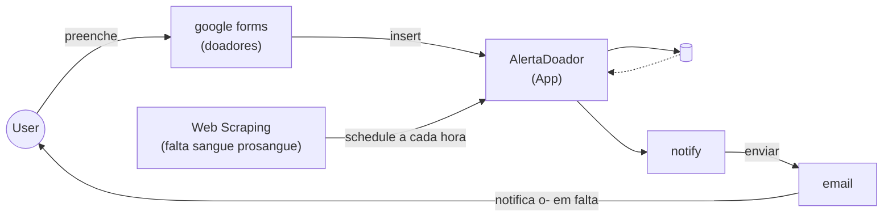

# AlertaDoador

**Projeto Integrador - UNIVESP**

## Sobre o Projeto
O objetivo é conectar a demanda real dos hemocentros com alunos dispostos a doar enviando notificações direcionadas apenas quando um tipo sanguíneo específico entra em falta.

## Como Iniciar (Desenvolvimento)

Para rodar o projeto localmente usando Docker, siga os passos abaixo:

### Pré-requisitos
- [Docker](https://docs.docker.com/get-docker/)
- [Docker Compose](https://docs.docker.com/compose/install/)
- [Make](https://www.gnu.org/software/make/) (opcional, mas recomendado)

### Passos
1. **Construir as imagens:**
   ```bash
   make build
   # ou: docker compose build
   ```

2. **Subir os serviços:**
   ```bash
   make up
   # ou: docker compose up -d
   ```

3. **Acessar as aplicações:**
   - **Frontend:** [http://localhost:3000](http://localhost:3000)
   - **Backend (API):** [http://localhost:8000](http://localhost:8000)
   - **Documentação API (Swagger):** [http://localhost:8000/docs](http://localhost:8000/docs)

4. **Ver logs:**
   ```bash
   make logs
   # ou: docker compose logs -f
   ```

5. **Parar os serviços:**
   ```bash
   make down
   # ou: docker compose down
   ```


## Como Funciona (Fluxo)




1. **Coleta (Google Forms):** Alunos do polo preenchem um formulário com seus dados básicos e tipo sanguíneo.
2. **Monitoramento (Web Scraping):** O sistema checa periodicamente os níveis de estoque no site do hemocentro.
3. **Notificação (E-mail):** Quando o estoque de um tipo sanguíneo atinge nível crítico ou baixo, o sistema cruza as informações e dispara um alerta aos alunos compatíveis.

# Estrutura
```text
alerta-doador/
├── backend/
│   ├── src/
│   │   ├── domain/          # Models, Enums
│   │   ├── repositories/    # DonorRepository
│   │   ├── services/        # InventoryScraper, AlertSender
│   │   └── main.py          # ou index.ts
│   ├── tests/               # AAA pattern
│   ├── Dockerfile
│   └── requirements.txt     #
├── frontend/
│   ├── public/
│   ├── src/
│   │   ├── components/
│   │   ├── pages/
│   │   ├── services/        # API calls
│   │   └── App.tsx
│   ├── tests/               # AAA pattern
│   ├── Dockerfile
│   └── package.json
├── docker-compose.yml
├── Makefile
├── .gitignore
└── README.md
```

## Padronização e Qualidade de Código

O projeto utiliza o **Ruff** como ferramenta unificada para linting, formatação e ordenação de imports, garantindo rapidez e consistência.

### Linting e Formatação Local

Para rodar o Ruff manualmente:
```bash
# Verificar erros (Lint)
ruff check .

# Aplicar correções automáticas
ruff check . --fix

# Formatar o código
ruff format .
```

### Pre-commit
Configuramos o `pre-commit` para impedir commits que não sigam os padrões. Para instalar e ativar:
```bash
# Instalar dependências de desenvolvimento
pip install -r backend/requirements-dev.txt

# Ativar pre-commit
pre-commit install
```

### CI/CD (GitHub Actions)
A cada push ou pull request, o GitHub Actions executa automaticamente o Ruff para validar o código. Caso existam erros, o merge será bloqueado.

---

## Domínio e Arquitetura

**Schemas:**
* `users`
* `blood_banks`
* `blood_bank_stocks`
* `notifications`

**Enums:**
* `BloodType` (A_POSITIVE, O_NEGATIVE, etc.)
* `StockStatus` (CRITICAL, LOW, STABLE)

**Layers (Serviços):**
* `InventoryScraper`: Serviço que extrai os dados do hemocentro.
* `DonorRepository`: Gerencia o acesso aos dados coletados.
* `AlertSender`: Motor de cruzamento de dados e disparo de e-mails.


## 🐶 API Client (Bruno)

Este projeto utiliza o [API Client Bruno](https://www.usebruno.com/) como cliente de API Git-native.

### Como usar:
1. Instale o API Client Bruno no seu computador.
2. Abra o API Client Bruno e selecione **"Open Collection"**.
3. Navegue até a pasta raiz deste projeto e selecione a pasta `api-client`.
4. No canto superior direito do Bruno, selecione o ambiente **"Local"** para que a `base_url` seja configurada corretamente para `http://localhost:8000`.
5. Agora você pode testar os endpoints de categorias (`List`, `Create`, `Delete`).